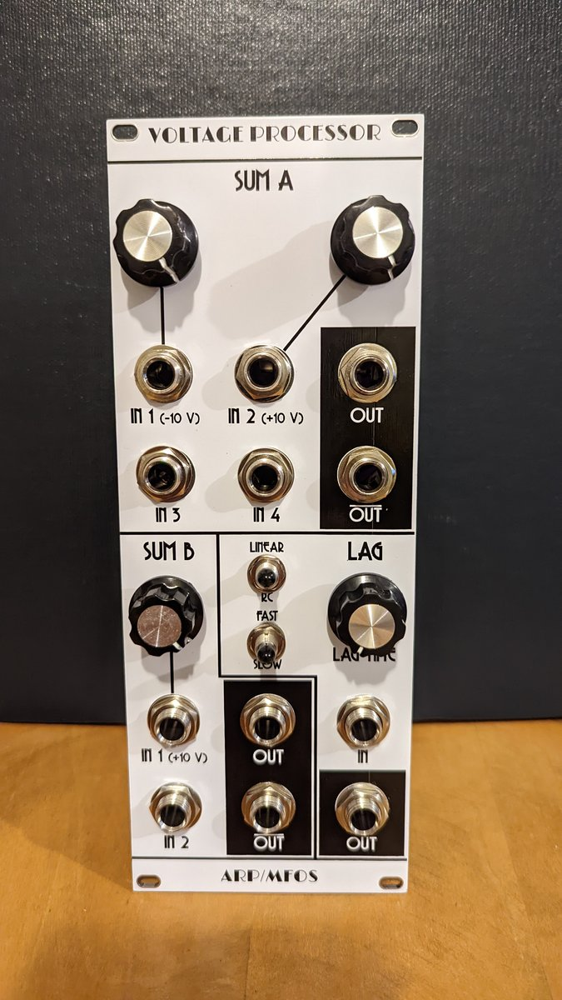
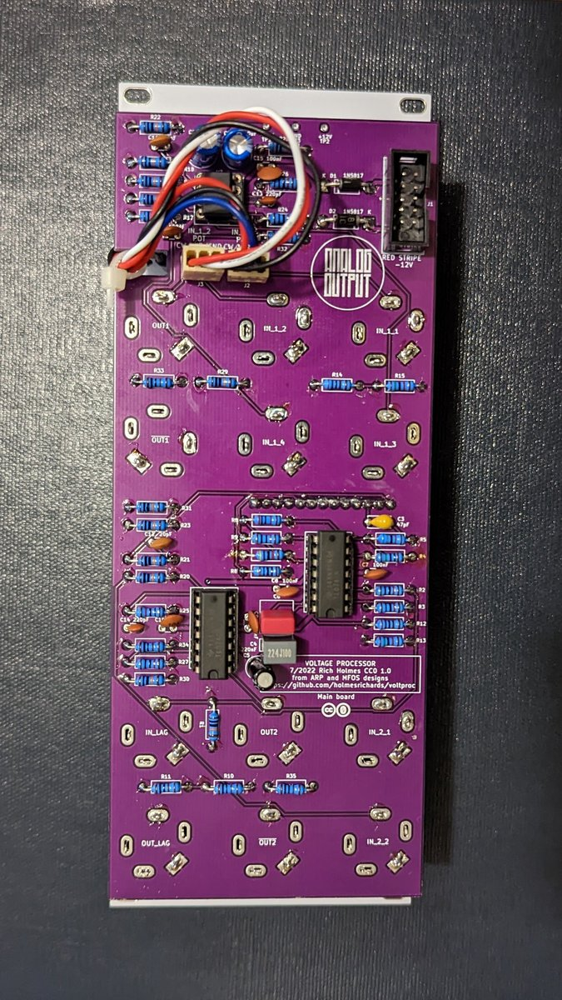

# Voltage processor

This is a voltage processor module based on designs by ARP and MFOS.

There are two sum sections: One has four inputs, two with attenuators (normaled to -10 V and +10 V) and two with fixed unity gain; the other has two inputs, one with attenuator (normaled to +10 V) and one with fixed unity gain. Each sum has two outputs, normal and inverted.

There also is a lag processor section. Switches allow selection of slow or fast ranges and RC or linear ramping, and a knob adjusts the lag time.

The sum sections are derived from the ARP 2600 schematics. Differences:

* Obviously, this is a module, so there is no normal connection to keyboard CV; instead the second input of the first sum is normaled to +10 V.
* Added second inverting stages for normal plus inverted outputs.
* TL07x op amps in place of LM301.
* Added series output resistors.

The lag processor is based on a section of the MFOS Multi Function Module. Differences:

* Common input and output for both linear and RC circuits.
* Shorter minimum linear lag time.
* 1k series resistors on outputs.


## Current draw
20 mA +12 V, 20 mA -12 V


## Photos





## Documentation

* [Schematic](Docs/voltproc.pdf)
* PCB layout: [front](Docs/voltproc_layout_front.pdf), [back](Docs/voltproc_layout_back.pdf)
* [BOM](Docs/voltproc_bom.md)
* [Build notes](Docs/build.md)
* [Blog post](https://analogoutputblog.wordpress.com/2022/11/26/processing-voltages/)

## GitHub repository

* [https://github.com/holmesrichards/voltproc](https://github.com/holmesrichards/voltproc)

## Submodules

## Submodules

This repo uses submodules aoKicad and Kosmo_panel, which provide needed libaries for KiCad. To clone:

```
git clone git@github.com:holmesrichards/voltproc.git
git submodule init
git submodule update
```


Alternatively do

```
git clone --recurse-submodules git@github.com:holmesrichards/voltproc.git
```

Or if you download the repository as a zip file, you must also click on the "aoKicad" and "Kosmo\_panel" links on the GitHub page (they'll have "@ something" after them) and download them as separate zip files which you can unzip into this repo's aoKicad and Kosmo\_panel directories.

If desired, copy the files from aoKicad and Kosmo\_panel to wherever you prefer (your KiCad user library directory, for instance, if you have one). Then in KiCad, go into Edit Symbols and add symbol libraries 

```
aoKicad/ao_symbols
Kosmo_panel/Kosmo
```
and go into Edit Footprints and add footprint libraries 
```
aoKicad/ao_tht
Kosmo_panel/Kosmo_panel.
```
