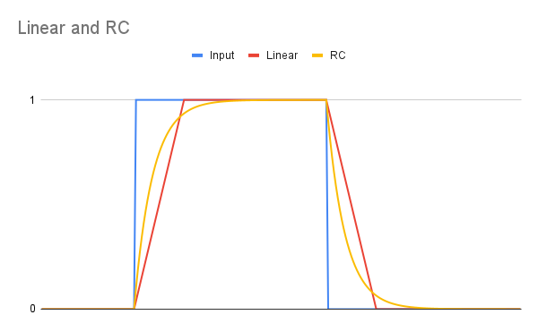

# Voltage processor

This is a utility synth module in Kosmo format. It started as an adaptation of the voltage processor section from the ARP 2600, but with some modifications, and it ended up with the ARP lag processor replaced by one based on that of the Music From Outer Space [Multi Function Module](http://musicfromouterspace.com/analogsynth_new/MULTIFUNCTIONMODULE/MULTIFUNCTIONMODULE.php).

There are three independent sections: Two CV summers and a lag processor.

The summers can be used to add DC offsets to control voltages and to invert them as well as summing them. The first summer has four inputs. Two have attenuators, and these inputs are normalled to -10 V and +10 V. The sum of all four inputs, both inverted and non inverted, goes to output jacks. The second summer is the same but has only two inputs, one with an attenuator and normalled to +10 V.

The lag processor can be used for portamento and glide effects, or as a simple AR envelope generator or a manually controlled low pass filter to smooth rapid changes in a control voltage. The speed is controlled by a knob, and by a switch that selects slow or fast speed ranges. Another switch selects between linear ramping and RC shape lag.

